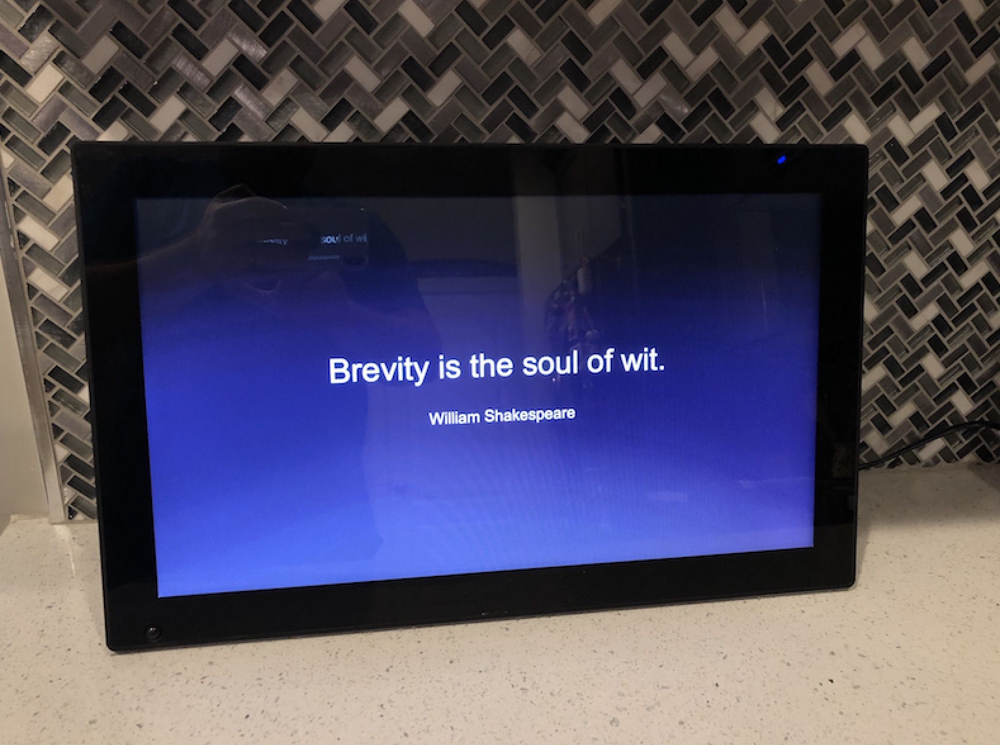
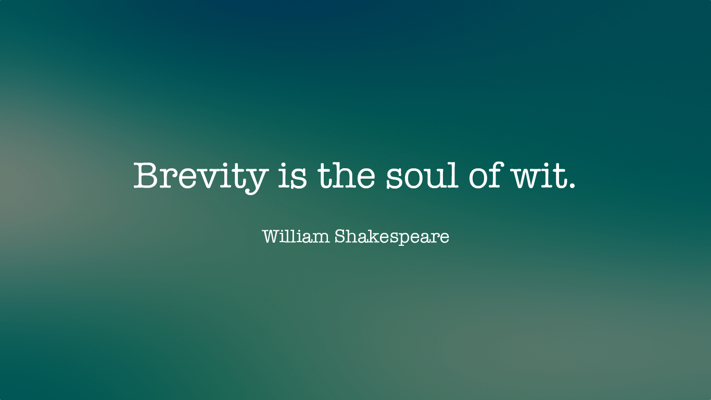

# Quote Renderer

---

I love a good quote. To put my growing collection of material to good use, I recently purchased a large [digital photo frame](https://www.amazon.com/gp/product/B00JEX926C) with which to put them on display.

With this script, you can specify a text file containing quotes along with a folder containing background images onto which they are to be superimposed. The script will automatically choose the appropriate font sizes and align them correctly (see photo and examples below).

## Digital Frame



## Example Images



## Getting Started

First, install required dependencies.

```
$ yarn
```

Next, modify the contents of `run.js` as needed.

```
const Renderer = require('./lib/renderer');
const path = require('path');

const renderer = new Renderer({
    // The folder from which fonts are to be loaded
    'font_path': path.resolve(__dirname, 'assets/fonts/american-typewriter'),
    // The folder to which generated images are to be saved
    'output_path': path.resolve(__dirname, 'output'),
    // The folder from which to pull background images.
    'background_path': path.resolve(__dirname, 'assets/images'),
    // A text file containing quotes. Each quote should appear on its own line.
    // The quote and the source should be separated by two dashes (--). For example:
    // Brevity is the soul of wit. -- William Shakespeare
    'quotes': path.resolve(__dirname, 'quotes.txt')
});

renderer.run();
```

Finally, run the scripts as shown below.

```
$ node run
```

## Related Resources

- [Littera](http://kvazars.com/littera/) - A web-based application (requires Flash) for converting commonly-used font formats to bitmap fonts.